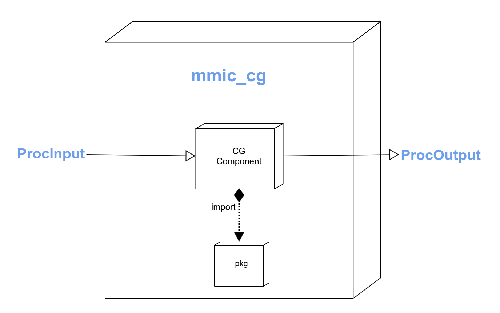

# Coarse-Graining Component

[//]: # (Badges)
[](https://github.com/molssi/mmic_cg/actions?query=workflow%3ACI)
[](https://codecov.io/gh/molssi/mmic_cg/branch/main)
[](https://lgtm.com/projects/g/molssi/mmic_cg/context:python)

This is part of the [MolSSI](http://molssi.org) Molecular Mechanics Interoperable Components ([MMIC](https://github.com/MolSSI/mmic)) project. This package provides a component for coarse-graining molecules.

<p align="center">

</p>

# Basic Usage

## Preparing Input
```python
# Import main component for coarse-graining
from mmic_cg.components import CoarseComponent

# Import a molecule model that complies with MMSchema
from mmelemental.models import Molecule
from mmic_cg.models import InputCoarse

# Create MMSchema molecule
mol = Molecule.from_file(path_to_file)

# Create input for coarse-graining a molecule with protoMD
cgInp = InputCoarse(
    "molecule"=mol, 
    "method"="spacewarping",
    "method_keywords"={
        "kmax": 1,
        "polynomial": "legendre",
    },
)
```

## Run The CG Algorithm
```python
# Execute coarse-graining
cgOut = CoarseComponent.compute(cgInput)
```

## Extracting Output
```python
# Extract MMSchema CG mol
cgMol = cgOutput.mol
cgVel = cgOutput.mol["velocities"]
cgPos = cgOutput.mol["geometry"]
```

### Copyright

Copyright (c) 2021, Xu Guo, Andrew Abi-Mansour


#### Acknowledgements
 
Project based on the 
[Computational Molecular Science Python Cookiecutter](https://github.com/molssi/cookiecutter-cms) version 1.1.
